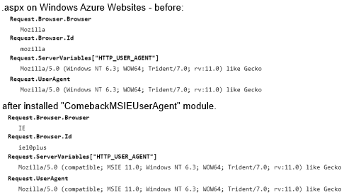
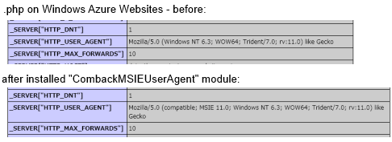

What's this? / これは何か?
==========================

This is a ASP.NET HTTP module.  
This module modify user agent string sent by Internet Explorer(IE) 11 
from modern style to legacy compatible style.

これは ASP.NET の HTTP モジュールです。  
このモジュールは Internet Explorer(IE) 11 から送信されるユーザーエージェント文字列を、
旧バージョンと互換のある形式に変更します。

Background / 背景
==================

We know, the user agent string of IE11 changed from old version 
to disapper "MSIE" string.  
We should focus browser capabilities, shuold not detect browser "name", I think so.

周知のとおり、IE11 からユーザーエージェント文字列が変わり、"MSIE" の文字列が消え去りました。  
我々はブラウザの機能に着目すべきで、ブラウザの名前を検出すべきではなく、私もそう思います。

But there are legacy code somethimes, and thease codes detect browser
by searching "MSIE" from user agent string and change behavior by browser name.

しかし時には古いコードが残っており、その古いコードではユーザーエージェント文字列から "MSIE" の
文字列を検索することでブラウザを検出し、ブラウザの名前で振る舞いを変更しています。

Even .NET Framework is too.  
If you have not installed KB, .NET Framework deside IE11 is a disability browser.  
ex. "This browser does not support cookie!".  

.NET Framework でさえそうです。  
最新のパッチを適用していないと、.NET Framework は IE11 を機能の劣ったブラウザと判定します。  
例) 「このブラウザはクッキーに対応していない!」

Effect / 効能
=============

After you installed this module in the ASP.NET Web application, 
the application receive user agent string which modified legacy style at the request from IE11.

このモジュールをインストールしたあとは、IE11からの要求時、旧来形式に変更された
ユーザーエージェント文字列を受け取ります。

User agent string sent by IE11 before install this module looks like
from the ASP.NET application code:  
このモジュールをインストールする前、IE11から送信されたユーザーエージェント文字列は、
ASP.NET アプリケーションのコードからは以下のように見えます:

    Request.UserAgent == "Mozilla/5.0 (Windows NT 6.3; WOW64; Trident/7.0; rv:11.0) like Gecko"

and after install:  
そしてインストール後はこうなります:

    Request.UserAgent == "Mozilla/5.0 (compatible; MSIE 11.0; Windows NT 6.3; WOW64; Trident/7.0; rv:11.0) like Gecko"

**Example / 例**  


How to install / インストール手順
=================================

a. Manual install / 手動インストール
------------------------------------

1. Download "ComeBackMSIEUserAgent.dll" from [here](https://github.com/jsakamoto/ComeBackMSIEUserAgent/releases/latest) 
into "/bin" folder in the ASP.NET application.  
"ComeBackMSIEUserAgent.dll" を [ここ](https://github.com/jsakamoto/ComeBackMSIEUserAgent/releases/latest) から
ダウンロードして ASP.NET アプリケーションの "/bin" フォルダに入れます。

2. Edit "/web.config" file (create if not exist) to insert follow line.  
"web.config" を編集し (もしなければ作成)、以下の行を追加します。

```
<system.web>
  <httpModules>
    <add name="ComeBackMSIEUserAgent" 
         type="Toolbelt.Web.ComeBackMSIEUserAgentModule, ComeBackMSIEUserAgent" />
  <httpModules>
<system.web>
<system.webServer>
  <validation validateIntegratedModeConfiguration="false"/>
  <modules>
    <add name="ComeBackMSIEUserAgent" 
         type="Toolbelt.Web.ComeBackMSIEUserAgentModule, ComeBackMSIEUserAgent"
         preCondition="integratedMode" />
  <modules>
<system.web>
```

b. Install by NuGet / NuGet でインストール
------------------------------------------

This module is published on nuget.org as a NuGet package.  
So, you can install this module on Visual Studio IDE.

このモジュールは NuGet パッケージとして nuget.org に公開済みです。  
よって、Visual Studio 統合開発環境上からこのモジュールをインストールできます。

Only you need to do is enter follow commnad from NuGet Package Manager Console in Visual Studio.

あなたがやるべきことは、以下のコマンドを、Visual Studio のパッケージ管理コンソールから入力するだけです。

    PM> Install-Package ComeBackMSIEUserAgent	

PHP on Windows server OS with IIS7+ integrated mode / 統合モードのIIS7以降による Windows Serevr OS 上の PHP
================================================

This module effect not only ASP.NET but any web application frameworks 
on IIS7+ integreated pipline, such as PHP.

このモジュールは ASP.NET だけでなく、PHP のように、
IIS7以降の統合パイプライン上で動く Web アプリケーション何にでも
効果を発揮します。

If you have a site which built by PHP on IIS7+ integrated mode,
you can install this module (refer "a. Manual install"),
then your PHP site get legacy style user agent string from IE11. 

もし IIS7 以降の統合モード上に構築された PHP サイトがあれば、
このモジュールをインストールすることで ( "a. 手動インストール" を参照 )
その PHP サイトは、IE11からのユーザーエージェント文字列を旧来形式で
取得するようになります。

**Example / 例**  


Notice / 注意
=============

This module is a **last resort.**  
このモジュールは **最後の手段です。**

We should not search "MSIE" from raw level user agent string, 
we should refer HttpBrowserCapabilities object instead.  
我々は生のユーザーエージェント文字列から "MSIE" の文字列を探すべきではなく、
代わりに HttpBrowserCapabilities オブジェクトを参照すべきです。

And, we should update .NET Framework, update browser definition file of ASP.NET.  
そして .NET Framework を更新し、ASP.NET のブラウザ定義ファイルを更新すべきです。

Web shuld know there is an another way to resolve this problem 
that using custom .browser file in App_Browser folder.  
この問題を解決するには、カスタムの .browser ファイルを App_Browser フォルダに
配置する方法もあることを知っておくべきでしょう。

This module intercept **all** request, so tihs module has performance issue.  
このモジュールは **すべての** 要求を傍受するので、速度上の課題があります。
